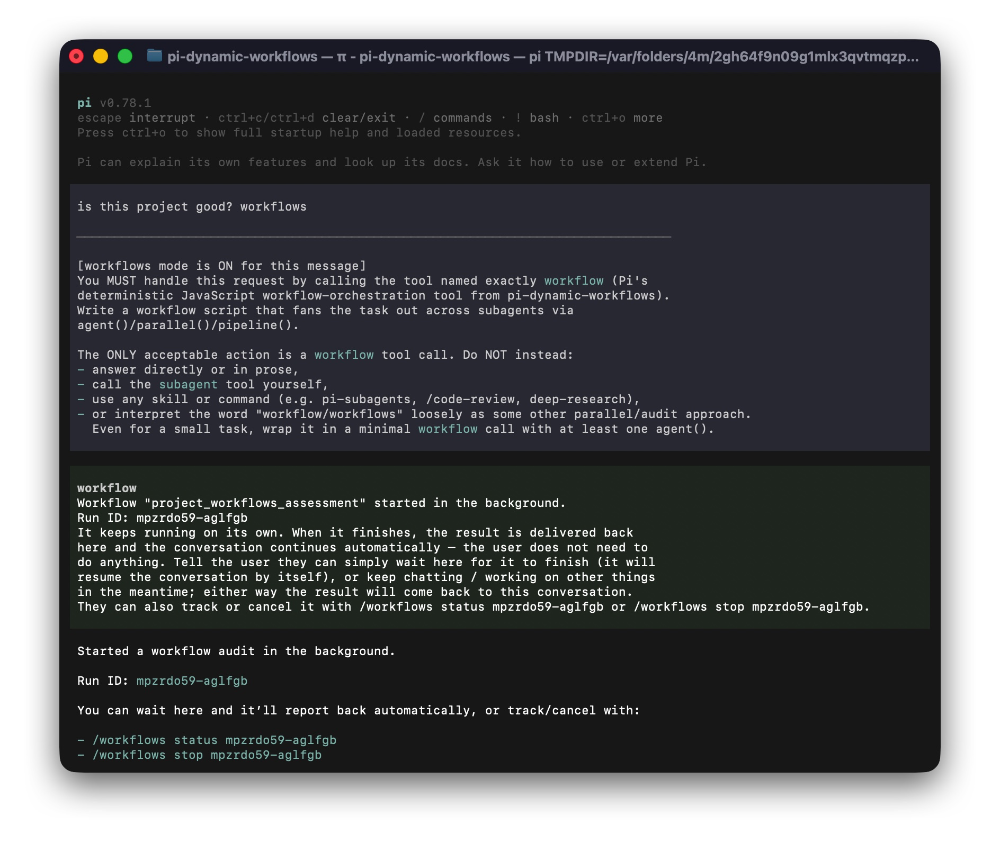

# pi-dynamic-workflows

[](https://www.npmjs.com/package/@quintinshaw/pi-dynamic-workflows)
[](#license)
[](https://pi.dev)
[](#development)

> **Claude Code–style dynamic workflows for [Pi](https://pi.dev).**
> Turn one prompt into a fleet of subagents that fan out in parallel, cross-check each other, and hand back a single synthesized answer.

**[Website](https://quintinshaw.github.io/pi-dynamic-workflows/) · [npm](https://www.npmjs.com/package/@quintinshaw/pi-dynamic-workflows) · [Pi package](https://pi.dev/packages/@quintinshaw/pi-dynamic-workflows) · [GitHub](https://github.com/QuintinShaw/pi-dynamic-workflows)**


Instead of one model grinding a task step by step, Pi writes a small JavaScript **orchestration script** that spawns many subagents at once, keeps the intermediate work in script variables (not your chat context), and returns only the result. It's the "code mode for subagents" from Claude Code — on any model Pi can reach.

Built for **codebase-wide audits, multi-perspective review, large refactors, and cross-checked research** — anything one context window can't hold.

## Install

```bash
pi install npm:@quintinshaw/pi-dynamic-workflows
```

Then `/reload` in Pi. You get the `workflow` tool plus the `/workflows`, `/deep-research`, and `/adversarial-review` commands.

## Try it

Ask in plain language:

```text
Run a workflow to audit every route under src/routes/ for missing auth checks.
```

Pi writes the script and runs it in the background — your turn ends immediately and a live panel tracks progress while you keep working. Or just type the word **workflows** in any message to force one:



## What a workflow looks like

Plain JavaScript. The first statement exports literal metadata; then you orchestrate:

```js
export const meta = {
  name: 'auth_audit',
  description: 'Find routes missing auth checks and verify the findings',
  phases: [{ title: 'Scan' }, { title: 'Review' }, { title: 'Verify' }],
}

phase('Scan')
const files = await agent('List every route file under src/routes/.', { tier: 'small' })

phase('Review')
const findings = await parallel(
  files.split('\n').filter(Boolean).map((file) =>
    () => agent(`Audit ${file} for missing auth checks.`, { tier: 'medium', isolation: 'worktree' }),
  ),
)

phase('Verify')
return await agent('Synthesize and double-check these findings:\n' + findings.join('\n\n'), { tier: 'big' })
```

`agent()` spawns an isolated subagent, `parallel()` runs many at once, `phase()` groups them in the live view, and `tier` routes each one to the right model. That's the whole idea.

## Highlights

- **Fan-out orchestration** — `agent()`, `parallel()`, `pipeline()`, `phase()` in a sandboxed script. Up to 16 concurrent / 1000 total subagents; intermediate results stay in variables, not the chat.
- **Real model routing** — `small` / `medium` / `big` tiers (or an exact `model`) per agent. It actually switches the subagent's model — cheap work on a light one, hard synthesis on a big one.
- **Journaled resume** — an interrupted run replays finished agents from a journal (no re-run, no tokens) and runs only what's left or what you changed.
- **Git worktree isolation** — `isolation: "worktree"` gives an agent its own branch, so parallel agents can edit the same files without clobbering each other.
- **Real token & cost accounting** — read from each subagent's session, not estimated. `budget` gates on the real total and `/workflows` shows the dollar cost.
- **Background by default** — the turn ends right away, a live "Workflows running" panel tracks runs, and each result is delivered back so the conversation auto-continues when it finishes.
- **Interactive `/workflows` TUI** — drill runs → phases → agents → detail; pause, stop, restart, and save runs from the keyboard.
- **Quality patterns built in** — `verify()`, `judgePanel()`, `loopUntilDry()`, and `completenessCheck()` for adversarial review, best-of-N, and exhaustive discovery.
- **Ultracode** — `/ultracode` is a standing opt-in that auto-arms an exhaustive multi-agent workflow for every substantive message, the way Claude Code's ultracode does. `/effort high` is the lighter tier.
- **Bundled `/deep-research` + `/adversarial-review`** — real web search, source cross-checking, and cited reports.
- **Saved & nested workflows** — turn any run into a `/<name>` command, and compose saved workflows from inside other scripts.

## How it maps to Claude Code dynamic workflows

The same model — on Pi, plus the production pieces a real run needs:

| Claude Code dynamic workflows | pi-dynamic-workflows (on Pi) |
| --- | --- |
| Code-mode orchestration — the model writes a script that drives subagents | A JS `workflow` tool running `agent()` / `parallel()` / `pipeline()` / `phase()` in a vm sandbox |
| Subagents with isolated context | Fresh in-memory Pi sessions; results held in script variables, not the chat |
| Structured outputs | JSON-Schema `schema` → a validated object, with bounded repair if the model misses |
| Background runs | Non-blocking by default, a live task panel, and auto-continue delivery |
| Resume | **Journaled + replayable** — survives restarts and replays the unchanged prefix |
| Model selection | **Per-agent / per-phase routing** across any provider Pi is authenticated for |
| Ultracode (standing maximal-effort opt-in) | **`/ultracode`** (or `/effort ultra`) — auto-arms an exhaustive workflow for every substantive message |
| — | **Git worktree isolation**, **real cost accounting**, **`/deep-research`**, and a **quality-pattern stdlib** |

## Commands

```text
/workflows                  open the interactive navigator (plain list in print mode)
/workflows status <id>      watch a run live; print its result when it finishes
/workflows save <name>      save the latest run's script as a reusable /<name> command
/workflows pause|resume|stop|rm <id>
/workflows-models           map the small / medium / big tiers to real models
/ultracode [off]            ultracode: auto-arm an exhaustive workflow for every substantive message
/effort off|high|ultra      finer control over the standing opt-in (high = thorough, ultra = ultracode)

/deep-research <question>   web-researched, source-cross-checked report
/adversarial-review <task>  findings vetted by skeptical reviewers
```

In the navigator: `↑/↓` select · `enter`/`→` open · `esc`/`←` back · `p` pause · `x` stop · `r` restart · `s` save · `q` quit. Each agent shows the model it ran on.

## Reference

The full guide — every global, agent option, `agentType` definitions, structured output, and determinism — lives on the **[website](https://quintinshaw.github.io/pi-dynamic-workflows/)**. The essentials:

| Global | What it does |
| --- | --- |
| `agent(prompt, opts)` | Spawn an isolated subagent. Returns its final text, or a validated object with `opts.schema`. |
| `parallel(thunks)` | Run `() => agent(...)` thunks concurrently; results in input order. |
| `pipeline(items, ...stages)` | Fan items through sequential stages `(prev, original, index)`. |
| `phase(title, { budget? })` | Group agents in the live view; optional per-phase token sub-budget. |
| `verify` / `judgePanel` / `loopUntilDry` / `completenessCheck` | Built-in quality patterns. |
| `workflow(name, args)` | Run a saved workflow inline (shares the global caps). |
| `checkpoint(prompt, opts)` | A journaled, replayable human approval gate. |
| `budget` | `{ total, spent(), remaining() }` real-token tracker. |

| Agent option | Description |
| --- | --- |
| `tier` | `"small"` \| `"medium"` \| `"big"` — coarse model routing (configure via `/workflows-models`). |
| `model` | Exact `provider/modelId` (always wins over `tier`). |
| `agentType` | A named definition (`.pi/agents/<name>.md`) binding tools + model + role prompt. |
| `isolation: "worktree"` | Run in a throwaway git worktree for conflict-free parallel edits. |
| `schema` | JSON Schema → the subagent returns a validated object. |
| `label` / `phase` / `timeoutMs` | Display label / phase override / per-agent timeout. |

Workflows run in a Node `vm` sandbox; `Date.now()`, `Math.random()`, `new Date()`, and `require`/`import`/`fs`/network are unavailable, so runs stay reproducible — which is what makes resume reliable.

## Development

```bash
npm install
npm test     # biome + tsc + 622 unit tests
```

Every feature is also verified end-to-end against a real Pi subagent session before release.

## Credits

The "code mode for subagents" idea comes from Michael Livs' original [pi-dynamic-workflows](https://github.com/Michaelliv/pi-dynamic-workflows) and Anthropic's [dynamic workflows in Claude Code](https://claude.com/blog/introducing-dynamic-workflows-in-claude-code). This project builds on it with real model routing, journaled resume, git-worktree isolation, cost accounting, an interactive TUI, and deep research.

## License

MIT — see [LICENSE](LICENSE).
